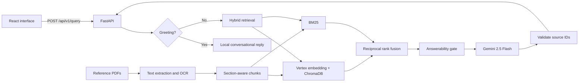

# Enterprise AI Document Assistant

A document-grounded assistant built for the AgamiSoft AI Solutions Engineer assessment. It answers employee policy questions from the supplied handbooks, identifies the source document used for each answer, and declines questions that are outside the indexed material.

## Links

- **Live application:** https://ai-document-assistant-fa4b.onrender.com
- **GitHub repository:** https://github.com/Sojib4055/AI_Document_Assistant
- **API documentation:** https://ai-document-assistant-fa4b.onrender.com/docs

The Render service uses a free instance and may take about a minute to start after a period of inactivity.

## Document scope

The searchable knowledge base is intentionally limited to:

- The complete **Partex-Star Group Employee Handbook** (printed pages 1–10)
- **Chapter II — Conditions of Service and Employment** (printed pages 25–32) from *A Handbook on the Bangladesh Labour Act, 2006*
- **Chapter IX — Working Hours and Leave** (printed pages 56–60) from the same Labour Act handbook

AgamiSoft internal documents are not included. The Labour Act handbook is used as an assessment reference and the application does not provide legal advice.

## What the application does

- Extracts text from the Partex handbook and uses OCR for scanned Labour Act pages
- Splits the selected content into section-aware chunks with document and page metadata
- Uses Vertex AI embeddings and ChromaDB for semantic retrieval
- Uses BM25 alongside vector search to retain strong keyword and section-title matching
- Combines both result lists with reciprocal rank fusion
- Checks whether the retrieved evidence is strong enough before generating an answer
- Uses Gemini to produce short answers from retrieved evidence only
- Keeps company policy and Labour Act handbook provisions as separate authorities
- Returns server-validated source document names instead of model-created citations
- Handles simple greetings without making an unnecessary model request
- Provides health checks, automated tests and a Docker deployment

## Architecture



### Request flow

1. The browser submits a question to FastAPI.
2. Simple social messages such as `hello` are answered locally.
3. Document questions are searched through ChromaDB and BM25.
4. Reciprocal rank fusion combines the semantic and keyword rankings.
5. The answerability gate rejects weak or unrelated matches.
6. Gemini receives only the selected document chunks.
7. The API validates Gemini's source IDs against server-side metadata before returning the answer.

## Models and main libraries

| Component | Purpose |
|---|---|
| Gemini 2.5 Flash | Grounded answer generation |
| Gemini Embedding 001 | Document and query embeddings |
| Google Gen AI SDK | Vertex AI model access |
| ChromaDB | Vector storage and semantic search |
| BM25 | Keyword retrieval |
| FastAPI and Uvicorn | Backend API and web server |
| PyMuPDF | PDF text and page extraction |
| Tesseract OCR | Text extraction from scanned pages |
| React, TypeScript and Vite | Browser interface and production frontend build |
| Pydantic | Configuration and API validation |
| Pytest | Automated backend tests |

## Page-number handling

Printed page numbers do not always match physical PDF page numbers. Both are stored in chunk metadata so retrieval can use the correct document section.

| Document | Printed pages | Physical PDF pages |
|---|---:|---:|
| Partex-Star Group Employee Handbook | 1–10 | 2–6 |
| Labour Act handbook, Chapter II | 25–32 | 42–49 |
| Labour Act handbook, Chapter IX | 56–60 | 73–77 |

The Partex PDF contains two printed pages on each landscape PDF page. Its ingestion loader separates these pages before creating chunks.

## Run with Docker

### Requirements

- Docker Desktop
- A Google Cloud project with Vertex AI enabled
- A service account with permission to use Vertex AI
- A valid service-account JSON key

Save the service-account key as `gcp-credentials.json` in the repository root. The filename is excluded by both `.gitignore` and `.dockerignore` and must never be committed.

Build and start the application:

```powershell
docker compose up --build
```

Open:

- Application: http://localhost:8000
- OpenAPI documentation: http://localhost:8000/docs
- Liveness check: http://localhost:8000/health/live
- Readiness check: http://localhost:8000/api/v1/health/ready

Stop the application with `Ctrl+C`, then remove the containers with:

```powershell
docker compose down
```

## Local development

Recommended versions:

- Python 3.12
- Node.js 22
- Tesseract 5 when regenerating OCR

Create and activate the Python environment on Windows PowerShell:

```powershell
python -m venv .venv
Set-ExecutionPolicy -Scope Process -ExecutionPolicy RemoteSigned
.\.venv\Scripts\Activate.ps1
pip install -r backend\requirements-dev.txt
```

Copy the example configuration and update the credential path if the JSON file is not in the repository root:

```powershell
Copy-Item .env.example .env
```

Start the backend from the repository root:

```powershell
$env:PYTHONPATH = "backend"
uvicorn app.main:app --reload --port 8000
```

Start the frontend in another terminal:

```powershell
cd frontend
npm install
npm run dev
```

The Vite development server is available at http://localhost:5173 and proxies API requests to the backend.

## Corpus ingestion

Processed chunks and cached OCR text are included in the repository. To regenerate the corpus:

```powershell
$env:PYTHONPATH = "backend"
python backend\scripts\ingest.py --rebuild
```

To rerun Tesseract instead of using the OCR cache:

```powershell
python backend\scripts\ingest.py --rebuild --force-ocr
```

The ingestion process writes normalized chunks to `data/processed/chunks.jsonl`. The Chroma index is generated at startup and is not committed.

## API

### Ask a question

`POST /api/v1/query`

```json
{
  "question": "What are the working hours on Saturday?"
}
```

Example response:

```json
{
  "answerable": true,
  "answer": "The Saturday working hours are 9:00 a.m. to 1:30 p.m.",
  "sources": [
    {
      "id": "S1",
      "document_id": "partex-star-employee-handbook",
      "document": "Partex Star Group Employee Handbook",
      "printed_page": 5,
      "pdf_page": 4,
      "section": "A. Code of Conduct - 1. Working Days and Hours",
      "snippet": "...",
      "source_category": "company_policy"
    }
  ],
  "request_id": "..."
}
```

Other endpoints:

- `GET /api/v1/documents` — indexed document summary
- `GET /health/live` — process health
- `GET /api/v1/health/ready` — document index readiness

## Grounding behavior

Retrieved chunks are labelled internally as `S1`, `S2` and so on. Gemini may select from those labels, but it cannot supply trusted document metadata directly. The backend resolves valid labels to known documents and discards unknown labels. A generated answer without a valid supporting source is rejected.

For questions that are not supported by the indexed material, the assistant returns:

> I couldn't find information about that in the provided documents. Please ask a question related to the available employee policy documents.

## Tests

Run the backend suite from the repository root:

```powershell
$env:PYTHONPATH = "backend"
python -m pytest backend\tests -q
```

The suite currently contains 15 tests covering:

- PDF and printed-page mapping
- Corpus ingestion output
- Hybrid retrieval of relevant sections
- Source metadata in responses
- Unsupported-question handling
- Greeting handling
- API validation and response contracts

Build the production frontend with:

```powershell
cd frontend
npm run build
```

## Deployment

The application is deployed as one Docker web service on Render. The Dockerfile uses a two-stage build: Node builds the React frontend, then the Python image serves the compiled frontend and FastAPI backend on port `8000`.

Render receives the GCP service-account JSON through the `GCP_CREDENTIALS_JSON` environment variable. The credential file is not part of the image or Git repository.

Required Render environment variables:

```text
GCP_CREDENTIALS_JSON=<complete service-account JSON>
APP_ENV=production
GCP_LOCATION=us-central1
LLM_PROVIDER=vertex
EMBEDDING_PROVIDER=vertex
MODEL_NAME=gemini-2.5-flash
VERTEX_EMBEDDING_MODEL=gemini-embedding-001
```

Health check path:

```text
/health/live
```

Pushing a commit to the `main` branch triggers a new Render deployment when auto-deploy is enabled.

## Project structure

```text
backend/
  app/
    api/          API routes
    ingestion/    PDF extraction, OCR and chunking
    models/       Request, response and document models
    services/     Retrieval, embeddings, generation and vector storage
  scripts/        Ingestion and evaluation commands
  tests/          Automated backend tests
data/
  source/         Supplied reference PDFs
  processed/      Normalized chunks and OCR cache
frontend/
  src/            React application
Dockerfile        Production image
docker-compose.yml
```

## Assumptions and limitations

- Answers are limited to the supplied documents and selected Labour Act handbook chapters.
- The Labour Act source is an assessment handbook, not a substitute for the authoritative law or legal advice.
- OCR output can contain recognition errors when source scans are unclear.
- The assistant does not search the internet or use information outside the indexed corpus.
- Conversation history is stored only in the browser and is lost when the page is refreshed.
- Authentication and role-based access are not included; test credentials are therefore not applicable.
- Render's free instance sleeps after inactivity and uses an ephemeral filesystem. A cold start may rebuild the vector index and take additional time.
- Vertex AI usage is billed separately by Google Cloud.
